# Module 1: Lighting Fundamentals

> **Estimated Time:** 2.5 hours | **Prerequisites:** None | **Pass Quiz:** 80% or higher

## Why This Matters

As an importer of commercial lighting products, you need to speak the language of the industry. This module provides the foundational vocabulary to communicate confidently with manufacturers, customers, and inspectors. Whether you're in purchasing, sales, technical support, or management, these fundamentals are essential for quoting, selling, supporting, and inspecting products.

## What You'll Learn

- Understand basic units used in commercial lighting (lumens, watts, efficacy)
- Explain color temperature (CCT) and color rendering (CRI)
- Identify major fixture types and their applications
- Differentiate between LED, fluorescent, and HID technologies

---

## Lessons in This Module

| # | Lesson | Topics Covered |
|---|--------|---------------|
| 1 | [Units of Measurement & Standards](#lesson-1) | Lumens, watts, efficacy, CCT, CRI, foot-candles, IES standards |
| 2 | [Lighting Technologies](#lesson-2) | LED, fluorescent, HID — advantages, limitations, when to use each |
| 3 | [Fixture Types](#lesson-3) | Troffers, panels, high bays, downlights, wall packs, canopy, area/flood lights, emergency |

---

## Lesson 1: Units of Measurement & Standards :id=lesson-1

<details class="clc-lesson-details" open>
<summary class="clc-lesson-summary">Show / hide this lesson</summary>

### The Language of Light

In commercial lighting, we measure different things than most people expect. Customers often ask "how bright is it?" but what they really need to know is more specific.

This lesson covers two different things: **units of measurement** (lumens, watts, efficacy, CCT, CRI, foot-candles — how we describe light) and **standards** (IES — how much light a space actually needs). Keep them separate in your head; customers often mix them up.

**How the core three relate:**

```
Efficacy (lm/W) = Lumens (lm) ÷ Watts (W)
```

Lumens measure the light a fixture puts out, watts measure the power it draws, and efficacy — their ratio — tells you how efficiently it converts one into the other. Keep this formula in mind as you go through each term below.

---

### Units of Measurement

#### 💡 Lumen (lm) — Light Output

**What it is:** The total amount of visible light emitted by a source in all directions.

**Why it matters:** This is the true measurement of brightness. For about 100 years, incandescent bulbs dominated the market and their efficiency was fairly consistent, so wattage correlated closely with brightness — simply knowing a bulb's wattage gave you a good idea of how much light it produced. Today, lighting technologies vary widely in efficiency, so lumens is the better way to describe how much light is actually being emitted. You'll use lumens every day when quoting projects and comparing products.

| Source | Lumens |
|--------|--------|
| Old 60W incandescent | 800 lm |
| Old 100W incandescent | 1,600 lm |
| Commercial LED troffer | 3,000–5,000 lm |
| LED high bay | 15,000–40,000 lm |

> **Customer scenario:** A warehouse manager says "I need something as bright as my old 400W metal halide." Your response should focus on lumens (typically 30,000–36,000 lm), not watts.

---

#### ⚡ Watt (W) — Power Consumption

**What it is:** The amount of electrical power the fixture uses.

**Why it matters:** Watts equal operating cost. Lower watts with the same lumens means better efficiency and energy savings for your customer — this directly impacts ROI calculations and competitive positioning.

**Critical point:** Watts do NOT measure brightness in LED lighting. A 100W LED fixture can be brighter than a 400W metal halide fixture.

> **Customer benefit:** "This 150W LED high bay replaces your 400W metal halide, cutting your energy use by 62%."

---

#### 📊 Efficacy (lm/W) — Efficiency

**What it is:** Lumens divided by watts. This tells you how efficient a fixture is.

**Formula:** `Efficacy = Lumens ÷ Watts`

**Example:** 4,000 lumens ÷ 40 watts = **100 lm/W**

**Why it matters:** Efficacy determines operating costs and rebate eligibility. Higher-efficacy fixtures qualify for DLC Standard or Premium certification, which means larger rebates and lower lifetime costs — often the deciding factor in competitive bids.

| Quality Tier | Efficacy |
|---|---|
| Budget LED | 80–100 lm/W |
| Good LED | 100–130 lm/W |
| Excellent LED | 130–160 lm/W |
| Premium LED | 160+ lm/W |
| Old fluorescent | 60–90 lm/W |
| Old metal halide | 60–80 lm/W |

**Sales relevance:** Always calculate and present efficacy when quoting. A fixture at 140 lm/W versus 110 lm/W can save customers hundreds of dollars per year in energy costs — often worth a higher initial price.

---

#### 🌡 CCT — Correlated Color Temperature (Kelvin)

**What it is:** The "warmth" or "coolness" of white light, measured in Kelvin (K).

**Why it matters:** Color temperature affects the mood and atmosphere of a space. Different applications call for different color temperatures — specifying the wrong CCT can result in customer dissatisfaction even when the light *level* is correct.

| Range | Appearance | Best For |
|---|---|---|
| 2700–3000K | Warm white (yellowish) | Restaurants, hotels, lobbies |
| 3500–4000K | Neutral white (clean) | Offices, schools, retail |
| 5000–6500K | Cool white/daylight (bluish) | Warehouses, hospitals, industrial |

> **Sales tip:** Many of our fixtures offer selectable CCT — the installer picks the color temperature on-site, so you don't need to pin down the exact atmosphere before ordering.

---

#### 🎨 CRI — Color Rendering Index

**What it is:** A scale from 0–100 measuring how accurately colors appear under a light source compared to natural sunlight.

**Why it matters:** Poor color rendering makes merchandise look unappealing in retail, food look unappetizing in restaurants, and can affect medical assessments in healthcare. CRI is critical for color-sensitive applications.

| CRI Range | Quality | Applications |
|---|---|---|
| 80–89 | Standard commercial | Most general applications |
| 90–95 | High quality | Retail, healthcare, art galleries |
| 95+ | Premium | Museums, high-end retail |

**Where it matters most:** Retail, hospitals, restaurants, art galleries.
**Where it matters less:** Warehouses, parking lots, industrial.

**Sales relevance:** All of our commercial lighting is 80+ CRI standard. Premium projects requiring color accuracy need 90+ CRI — the price difference is often minimal, but the impact on customer satisfaction is significant.

---

#### 🔦 Foot-Candle (fc) — Light Level on a Surface

**What it is:** The amount of light falling on a surface. This is how we measure whether a space has enough light.

> **Note:** Lux is the metric equivalent. **1 foot-candle ≈ 10.76 lux.** Some international manufacturers provide lux instead of foot-candles.

**The challenge:** Even if a fixture is rated for a certain lumen output, actual foot-candle levels on site can vary due to:

1. **Mounting height** — higher ceilings reduce light intensity on the work plane
2. **Room geometry & layout** — wide or irregular spaces can cause uneven distribution
3. **Surface reflectance** — dark walls, floors, or ceilings absorb light instead of reflecting it
4. **Fixture optics & beam angle** — narrow beams concentrate light, wide beams spread it thin

A fixture's foot-candle rating alone only tells part of the story — which is why the industry leans on IES standards and lighting design software to predict real-world results.

---

### Standards

Lumens, watts, efficacy, CCT, CRI, and foot-candles are all *units of measurement*. IES is different — it's the *standard* that tells you how much light (in foot-candles) a given space actually needs.

#### IES Lighting Standards

**What is IES?** The **Illuminating Engineering Society (IES)** is the recognized technical authority on lighting in North America. IES publishes the lighting level standards you'll use on every commercial project.

**Why IES standards matter:**
- Based on decades of research on human vision and task requirements
- Referenced by architects, engineers, and lighting designers
- Used for code compliance and design verification
- Industry-accepted standards worldwide

**How IES levels work:** IES lighting levels are expressed in foot-candles measured at the work surface:
- **Offices:** Measured at desk height (typically 30 inches above floor)
- **Warehouses:** Measured at floor level
- **Retail:** Measured at merchandise display level

**How IES files are used:** Lighting designers typically:
- Import IES files for each fixture type into lighting design software (e.g., AGi32, Dialux, Visual, Revit with lighting plugins)
- Place fixtures on the building blueprint according to the layout plan
- Define variables such as mounting height, spacing between fixtures, tilt/aiming angles, room dimensions, and surface reflectance
- Run photometric calculations to predict foot-candle (fc) levels at any point on the work plane

##### Common IES Recommended Lighting Levels

| Space | Recommended Level |
|---|---|
| Office (general) | 30–50 fc |
| Warehouse aisles | 10–20 fc |
| Warehouse high-activity | 30–50 fc |
| Retail sales floor | 30–50 fc |
| Retail accent displays | 150–300 fc |
| Fine dining | 5–15 fc |
| Casual dining | 15–30 fc |
| Kitchen | 50–100 fc |
| Parking lots | 1–5 fc |
| Classrooms | 30–50 fc |
| Patient rooms | 10–20 fc |
| Exam rooms | 50–75 fc |

**Quick reference rule** — when in doubt:
- Low light areas (ambiance, circulation): 5–20 fc
- Medium light areas (general work, retail): 30–50 fc
- High light areas (detailed tasks, inspection): 50–100+ fc
- Exterior areas (parking, walkways): 1–10 fc

---

</details>

## Lesson 2: Lighting Technologies :id=lesson-2

<details class="clc-lesson-details">
<summary class="clc-lesson-summary">Show / hide this lesson</summary>

### LED — Light Emitting Diode ✅ Dominant Technology

**What it is:** Solid-state lighting technology — electrons flow through a semiconductor to produce light.

**Key advantages:**
- High efficiency: 100–160+ lm/W
- Long life: 50,000–100,000 hours
- Instant on — no warm-up time
- Directional — light goes where you need it
- Dimmable — compatible with different control systems
- No mercury — environmentally friendly disposal
- Cold weather performance — works in freezing temperatures
- Rebate eligible — often qualifies for utility incentives

**Disadvantages:**
- Higher upfront cost (but ROI typically under 3 years)
- Quality varies greatly between manufacturers
- Heat management is critical (requires proper drivers and heat sinks)

**Real-world lifespan context:** A warehouse running lights 12 hrs/day:
- 50,000 hours = **11.4 years**
- 100,000 hours = **22.8 years**

This is huge for maintenance savings. Imagine a warehouse with 200 high bays mounted 30 feet in the air. Every time a bulb burns out, you may need to rent equipment to access the light, an electrician, and downtime. With LEDs, you might not touch those fixtures for a decade or more.

> 💡 **Sales Positioning:** LED is the only technology we recommend for new installations and replacements. The question isn't "should we use LEDs?" but "which LED products best fit your needs?"

---

### Fluorescent ⚠️ Declining Technology

Still common in many buildings — understand it to identify retrofit opportunities.

- Efficiency: 60–90 lm/W
- Life: 20,000–30,000 hours
- Requires ballast to operate
- Contains mercury (requires special disposal)
- Performance degrades in cold temperatures

**Common types, most to least common today:** T8 (still common but declining), T5 (more efficient than T8), T12 (obsolete, being phased out), Compact Fluorescent/CFL (mostly phased out)

---

### HID — High-Intensity Discharge ❌ Being Replaced

**Types:**

**Metal Halide (MH)**
- Used in warehouses, sports facilities, outdoor areas
- 60–80 lm/W | 15,000–20,000 hour life
- **5–10 minute warm-up time**
- **10–15 minute restart time** if power interrupts

**High-Pressure Sodium (HPS)**
- Used in street lighting, parking lots
- Yellow/orange color (CRI ≈ 20–25)

> ⚠️ **The warm-up problem:** Metal halide is completely incompatible with motion sensors. If power flickers, you wait 10–15 minutes for restart. LEDs are instant.

> 💡 **Sales opportunity:** A 400W metal halide (32,000 lm) replaced by a 150W LED (same lumens) = **250 watts saved per fixture** — 2.5 kilowatts saved every hour they run across 10 fixtures. Run 12 hours a day at the average US electricity rate, and that's roughly **$2,000 saved per year**.

---

</details>

## Lesson 3: Fixture Types :id=lesson-3

<details class="clc-lesson-details">
<summary class="clc-lesson-summary">Show / hide this lesson</summary>

### Indoor Fixtures

#### 1. Troffers

<div class="clc-fixture-photo-row">
<div class="clc-fixture-photo">

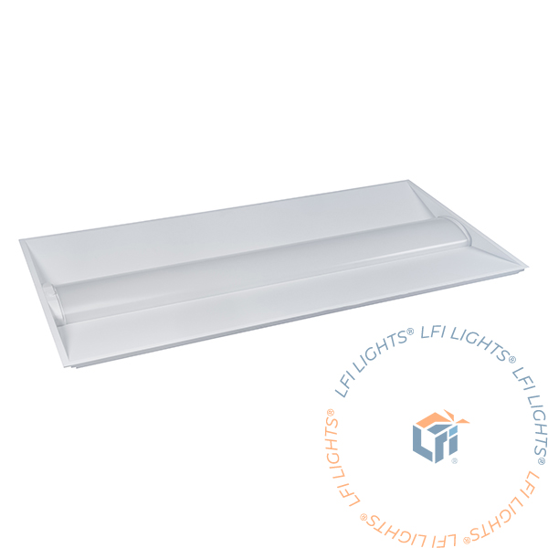

<span class="clc-fixture-caption">Troffer</span>
</div>
</div>

Recessed fixtures that fit into drop ceiling grids. This style dates back almost as far as the invention of ceiling grids and remains very popular — troffers are the most common fixture type in commercial buildings.

**Common sizes:** 2×4 ft (most common), 2×2 ft *(not currently stocked)*, 1×4 ft *(not currently stocked)*

**Types:**
- **Volumetric (prismatic lens)** — Traditional look, most cost-effective. Currently the only troffer type we stock.
- **Direct/Indirect** — Light goes both up and down, reduces glare *(not currently offered)*

**Typical specs:** 3,000–5,000 lm | 30–45W | 4000K | 80+ CRI

**Project relevance:** When specifying troffers, keep in mind what types and sizes we currently offer before recommending a product we don't sell — right now that's Volumetric, 2×4 ft.

---

#### 2. Panels (Flat Panels)

<div class="clc-fixture-photo-row">
<div class="clc-fixture-photo">

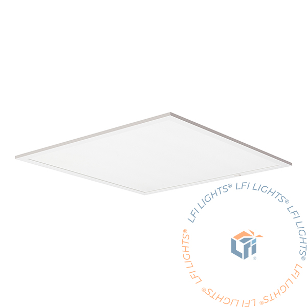

<span class="clc-fixture-caption">Flat panel</span>
</div>
</div>

Surface-mounted or suspended ultra-thin fixtures.

**Advantages:** Modern aesthetic, even light distribution, easy to install, thin profile (typically 0.5–2 inches thick).

**Mounting options:** Recessed, surface mount, suspended. Recessed and surface-mount styles require an additional mounting kit, which we offer (recessed/drywall mount kit, surface mount kit).

**Common sizes:** 2×2 ft (most popular), 2×4 ft, 1×4 ft *(not currently sourcing this size)*

---

#### 3. High Bays

<div class="clc-fixture-photo-row">
<div class="clc-fixture-photo">

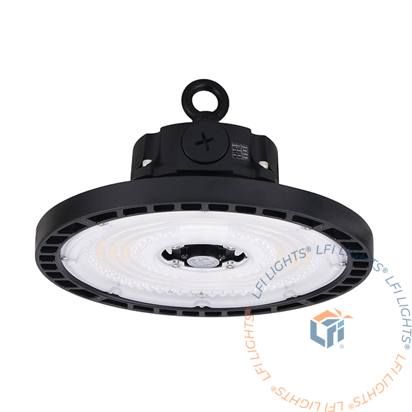

<span class="clc-fixture-caption">UFO high bay</span>
</div>
<div class="clc-fixture-photo">

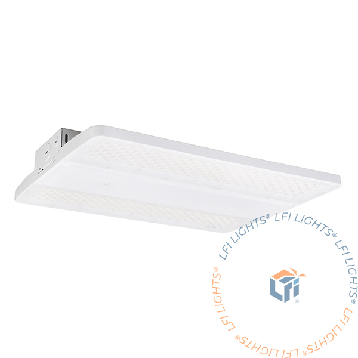

<span class="clc-fixture-caption">Linear high bay</span>
</div>
</div>

For spaces with ceilings 15 feet and above. Replacing metal halide high bays with LED is one of the highest ROI projects in commercial lighting — often payback under 2 years.

**Types:**
- **UFO (round)** — Compact, most popular style. Often comes standard with a hook mount.
- **Linear** — Narrow fixtures for warehouse aisles, directing light along the aisle length. Because these are now LED, the form factor is a bit stubbier than the long fluorescent-style linear high bays of the past.

The classic bell-shaped look can still be achieved on a UFO high bay using a polycarbonate (PC) reflector accessory, which directs light downward and limits the beam angle.

**Lumen guide by ceiling height:**
| Ceiling Height | Lumens Needed |
|---|---|
| 15–20 ft | 15,000–20,000 lm |
| 20–25 ft | 20,000–25,000 lm |
| 25–30 ft | 25,000–30,000 lm |
| 30–40 ft | 35,000–45,000 lm |

**Typical specs:** 100–300W | 4000–5000K CCT (most common in warehouses) | beam angles 60°, 90°, 120°

---

#### 4. Linear Style Fixtures

<div class="clc-fixture-photo-row">
<div class="clc-fixture-photo">

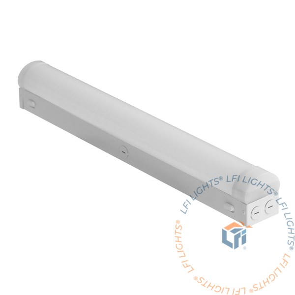

<span class="clc-fixture-caption">Strip</span>
</div>
<div class="clc-fixture-photo">

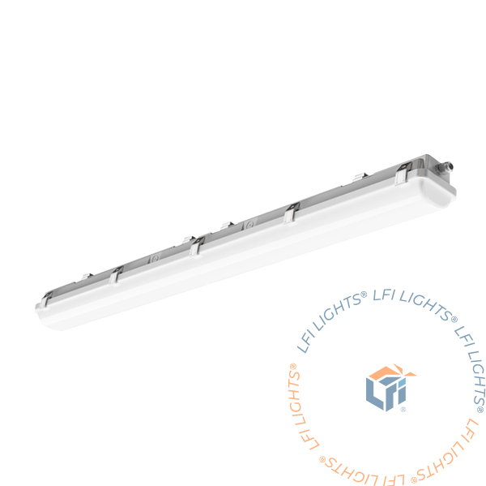

<span class="clc-fixture-caption">Vapor-tight</span>
</div>
<div class="clc-fixture-photo">

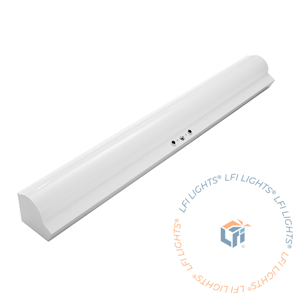

<span class="clc-fixture-caption">Stairwell light (built-in sensor)</span>
</div>
<div class="clc-fixture-photo">

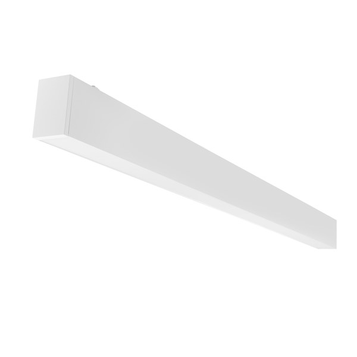

<span class="clc-fixture-caption">Architectural linear</span>
</div>
</div>

Long, narrow fixtures for continuous lighting.

**Types:**
- **Strip** — General purpose, cost-effective lighting
- **Vapor-tight** — Sealed for harsh/wet environments (IP65/66)
- **Architectural linear** — Sleek, high-end continuous lighting
- **Wraparound** — Basic enclosed fixture, more dated and largely replaced by Strip lights. *Not currently sourcing this type.*

---

#### 5. Downlights

<div class="clc-fixture-photo-row">
<div class="clc-fixture-photo">

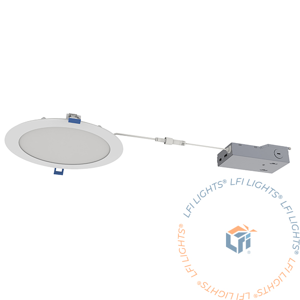

<span class="clc-fixture-caption">Downlight</span>
</div>
</div>

Recessed ceiling lights that direct light downward.

**Common sizes:** 4", 6", 8" diameter

**Types:** Fixed, Adjustable (aimable), Gimbal (rotates + tilts)

**Beam angles:** Narrow 25–40° (accent), Medium 40–60° (general), Wide 60–120° (area)

---

### Outdoor Fixtures

#### 6. Wall Packs

<div class="clc-fixture-photo-row">
<div class="clc-fixture-photo">

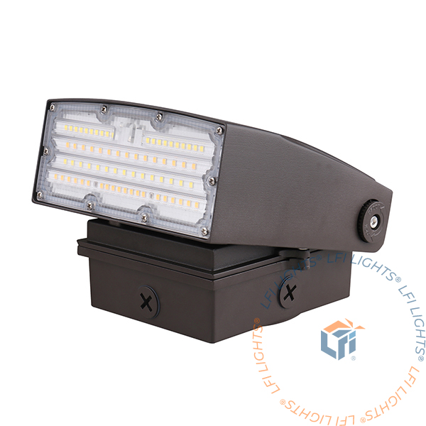

<span class="clc-fixture-caption">Adjustable wall pack</span>
</div>
<div class="clc-fixture-photo">

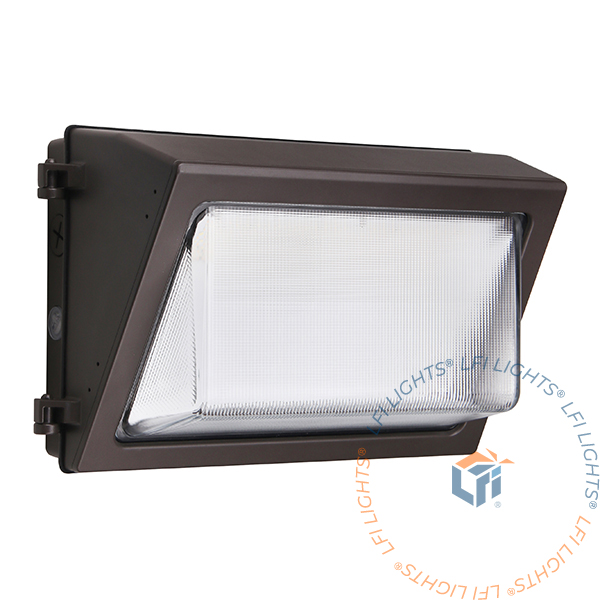

<span class="clc-fixture-caption">Standard wall pack</span>
</div>
</div>

Wall-mounted outdoor fixtures for building perimeters. Every commercial building has them.

**Types:** Full cutoff (dark sky compliant ✅), Semi-cutoff, Adjustable

**Typical specs:** 20–120W | 4000–5000K CCT (most common) | IP65 minimum

---

#### 7. Garage Canopy Light

<div class="clc-fixture-photo-row">
<div class="clc-fixture-photo">

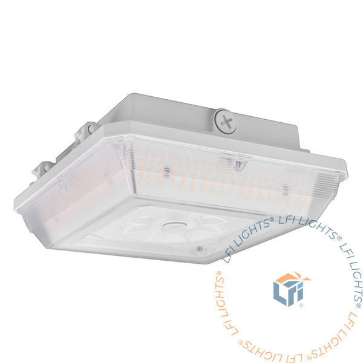

<span class="clc-fixture-caption">Garage / canopy light</span>
</div>
</div>

Surface-mounted for canopies, overhangs, and garage use. Often operates 24/7/365.

**Critical ratings:**
- **IP65/66** — Weatherproofing (rain, dust, temperature extremes)
- **IK08/10** — Impact resistance (vehicles, equipment, vandalism)

> ⚠️ Never compromise on quality for canopy/garage lights. The cost of failures far exceeds savings on cheap fixtures.

---

#### 8. Area Lights (Parking Lot) *— not currently stocked*

Pole-mounted or arm-mounted. LED conversions offer 60–70% energy savings vs. old HPS.

**IES Distribution Types:**
| Type | Pattern | Use |
|---|---|---|
| Type II | Narrow | Walkways, paths |
| Type III | Medium-width | **Most common — parking lot rows** |
| Type IV | Wide asymmetric | Perimeter lighting |
| Type V | Circular 360° | Open areas, intersections |

---

#### 9. Flood Lights *— not currently stocked*

Directional fixtures for highlighting specific areas.

**Beam angles:** Narrow 15–30° (spotlighting), Medium 30–60° (signs, facades), Wide 60–120° (area)

---

### Emergency Lighting

Emergency lighting is code-required in all commercial buildings. Non-compliance can result in failed inspections, fines, and liability if injury occurs during an emergency.

#### 10. Exit Signs

Required in every commercial building. Must typically be visible from 100 feet, depending on local code and where the sign is used.

- LED exit signs: **3–5W** (vs. 20–40W incandescent)
- Savings: ~140 kWh/year **per sign**

**Power options:**
- **AC only** — Powered by building electricity
- **Battery backup** — Continues during outages
- **Building emergency backup** — Powered by a building-provided emergency backup source (generator, inverter system, etc.)

**Code requirements:**
- Battery backup provides a minimum of 90 minutes runtime
- Red or green (green more common now)
- Must remain illuminated during emergencies
- Battery backup required in most jurisdictions
- Monthly function tests required (30 seconds)
- Annual full-discharge tests required (90 minutes)
- Must be visible from 100 feet (per local code — verify requirements)

#### 11. Emergency Lights

Activate during power outages to illuminate exit paths.

**Code requirements (NFPA 101):**
- Minimum **1 foot-candle** along egress path
- **90-minute** minimum runtime
- Monthly 30-second function tests required
- Annual 90-minute full-discharge tests required

**Types:**
- **Combo units** (integrated with exit signs) — Often the most convenient and cost-effective, since exit signs and emergency lighting are frequently required in the same areas
- **Remote heads** (separate from battery pack) — Standalone lights powered by a low-voltage source, typically a nearby compatible exit sign or emergency light with a battery large enough to power the remote head
- **Inverter systems** (power existing fixtures during emergency) — Premium solution for upscale applications, since it avoids installing emergency lighting fixtures that don't match the space's aesthetics

---

</details>

## Module 1 Quiz :id=quiz

Test your understanding of this module — 80% (8 of 10) required to pass.

<div class="clc-quiz" data-quiz-id="module-1"></div>

---

## Key Takeaways :id=key-takeaways

- ✅ Lumens = brightness, Watts = power consumption (not the same thing)
- ✅ Efficacy (lm/W) is how you compare fixture efficiency
- ✅ CCT sets the mood; CRI affects color accuracy
- ✅ LED has replaced fluorescent and HID for virtually all new projects
- ✅ Match fixture type to application and environment
- ✅ Emergency lighting is code-required — non-compliance has real consequences

---

## Glossary :id=glossary

| Term | Definition |
|---|---|
| Lumen (lm) | Total light output from a source |
| Watt (W) | Electrical power consumption |
| Efficacy (lm/W) | Efficiency measurement (lumens per watt) |
| Foot-candle (fc) | Light level on a surface |
| Lux | Metric equivalent of foot-candle (1 fc ≈ 10.76 lux) |
| CCT (Correlated Color Temperature) | Color appearance of white light, measured in Kelvin |
| CRI (Color Rendering Index) | Accuracy of color appearance (0–100 scale) |
| IES (Illuminating Engineering Society) | Technical authority that publishes lighting standards |
| LED | Light Emitting Diode — solid-state lighting technology |
| Troffer | Recessed fixture that fits in a ceiling grid |
| High Bay | Fixture for high-ceiling applications (15+ feet) |
| Wall Pack | Wall-mounted outdoor fixture |
| Garage/Canopy Light | Surface-mounted fixture for covered or garage areas |
| Area Light | Parking lot fixture |
| Exit Sign | Code-required signage for emergency egress |
| Emergency Light | Battery-backup lighting for power outages |

---

*Next: [Module 2 — Advanced Product Knowledge](/module-2/)*
